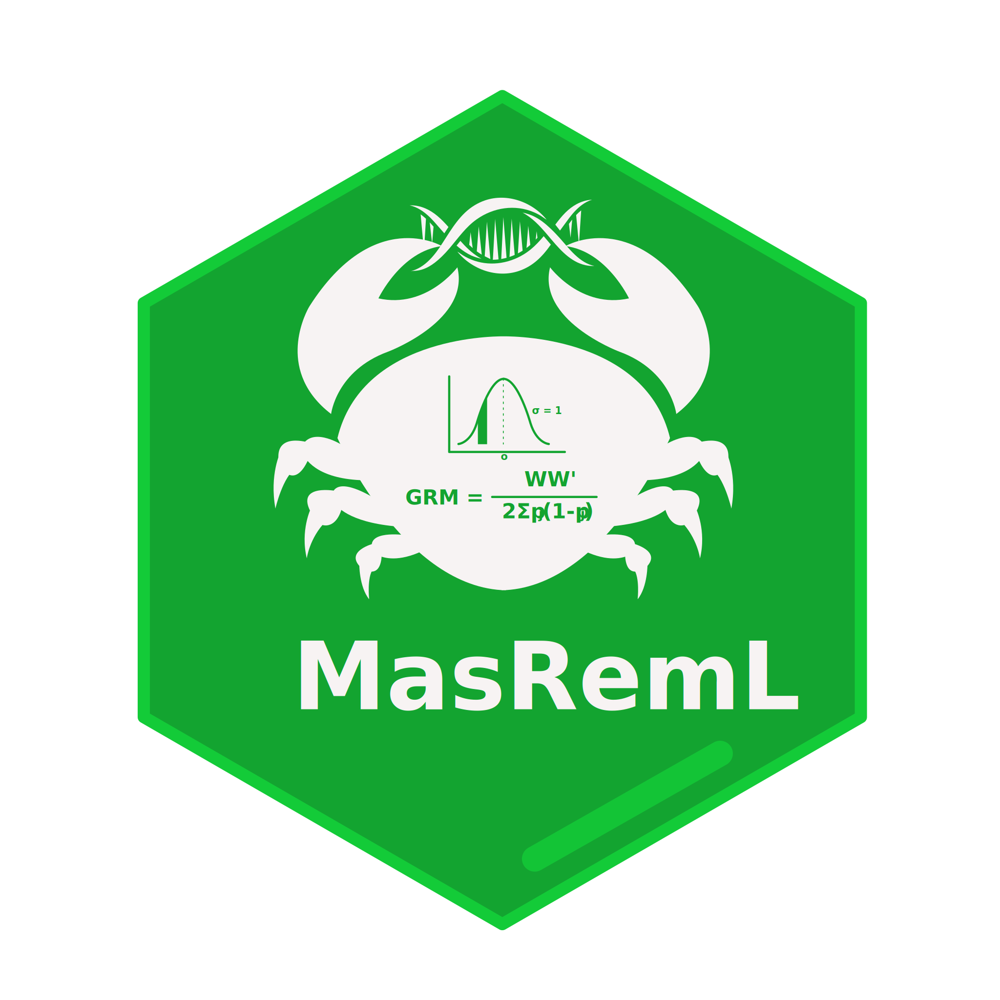

<a id="readme-top"></a>

<p align="center">
  
</p>

<h1 align="center">masreml</h1>

<p align="center"><em>REML-BLUP, GWAS, and GWABLUP for biallelic SNP and multi-allelic markers</em></p>

<p align="center">
  <a href="LICENSE"></a>
  <a href="https://www.r-project.org/"></a>
  <a href="https://rust-lang.org/"></a>
  <a href="https://bowo1698.github.io/masgenomics-docs/"></a>
</p>

---

## Overview

`masreml` implements REML-BLUP genomic prediction for both biallelic SNP and multi-allelic microhaplotype markers. It supports four relationship-matrix types (SNP additive, SNP dominance, multi-allelic additive, and pedigree A), multiple REML algorithms (AI, EM, HE, HE+AI), and binary traits via a single-step Laplace approximation. All numerical computation is handled by a Rust backend via [`extendr`](https://extendr.github.io/).

---

## Features

- REML algorithms: `AI`, `EM`, `HE`, `HE+AI`, `auto`
- Four relationship matrices: SNP additive (VanRaden 2008), SNP dominance (Da 2015), microhaplotype additive (Da 2015), pedigree A (Henderson 1976)
- Binary traits via single-step Laplace approximation (probit / logit link)
- EMMAX-based GWAS via `run_gwas()`
- GWAS-assisted prediction via `gwablup()` (Meuwissen 2024)
- Solvers: Cholesky (n < 10000) and PCG (n ≥ 10000); single `V` factorisation shared across REML, BLUP, and GWAS
- k-fold and LOO cross-validation via `cv_masreml()`
- S3 methods: `summary()`, `predict()`, `print()`

---

## Part of the masgenomics suite

`masreml` is one of three packages for end-to-end genomic prediction:

- **[maspipeline](https://github.com/bowo1698/maspipeline)** — preprocessing (phasing → haploblock discovery → microhaplotype genotyping)
- **masreml** *(this repo)* — REML-BLUP, GWAS (EMMAX), GWABLUP
- **[masbayes](https://github.com/bowo1698/masbayes)** — Bayesian genomic prediction (BayesA, BayesR)

Full documentation, tutorials, theory, and reference: **<https://bowo1698.github.io/masgenomics-docs/>**

---

## Installation

`masreml` compiles a Rust backend at install time. Install Rust via [rustup](https://rustup.rs/):

```bash
curl --proto '=https' --tlsv1.2 -sSf https://sh.rustup.rs | sh
```

Then in R:

```r
install.packages(
    "https://github.com/bowo1698/masreml/archive/refs/heads/main.tar.gz",
    repos = NULL, type = "source"
)
```

Installation details (Linux / macOS / Windows) and troubleshooting are in:
[masgenomics-docs › Installation](https://bowo1698.github.io/masgenomics-docs/installation/).

---

## Quick start

The bundled `load_data()` returns a small demo dataset (n=200, 100 SNPs, 50 MH blocks, h²≈0.5).

### SNP path (additive GBLUP)

```r
library(masreml)
d <- load_data()

G_add   <- build_G_snp(d$snp)
fit_snp <- masreml(
  y      = d$pheno$y_cont_qtl_snp,
  G      = list(snp_add = G_add),
  method = "auto"
)
summary(fit_snp)
```

### Multi-allelic (microhaplotype) path

```r
A_mh   <- build_G_mh(d$mh)
fit_mh <- masreml(
  y      = d$pheno$y_cont_qtl_mh,
  G      = list(mh_add = A_mh),
  method = "auto"
)
summary(fit_mh)
```

Full tutorials (GP + GWAS, SNP + MH, continuous + binary):
[masgenomics-docs › Tasks](https://bowo1698.github.io/masgenomics-docs/tasks/).

---

## Citation

```bibtex
@software{masreml,
  author = {Agus Wibowo},
  title  = {masreml: REML-BLUP genomic prediction for biallelic SNP and multi-allelic markers},
  year   = {2025},
  url    = {https://github.com/bowo1698/masreml}
}
```

---

## Development Team

**Lead Developer**

- Agus Wibowo — James Cook University

**Supervisors**

- Prof. Kyall Zenger
- Dr. Cecile Massault
- Dr. Dave Jones

---

## License

[GPL-3](LICENSE) © 2025 Agus Wibowo · Contact: aguswibowo1698@gmail.com

<p align="right"><a href="#readme-top">↑ back to top</a></p>
